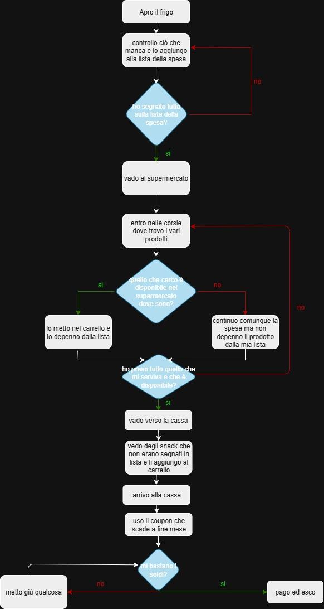

# human-code

## 🇬🇧 English Version

### # Overview

Group exercise focused on analysing a real-life problem, breaking it down into logical steps and producing a complete flowchart.

### # Assignment Summary

The exercise required to:

- Create the repository `human-code`
- Work in teams, each team solving the exercise with the same number (team 1 → exercise 1, team 2 → exercise 2, etc.)
- Analyse the assigned scenario through brainstorming
- Break the problem down into steps and create a flowchart (formal or informal)
- Export the diagram as JPG/PNG or write it as a README/text file
- Upload the final result to the repository

### # Assigned Scenario

**Task:** Grocery shopping using a checklist — _“Fatti mandare dalla mamma a prendere il latte”_

The fridge is almost empty, so it's time to restock.  
To avoid forgetting items, a checklist is created before going to the supermarket.  
Walking through the aisles, each item is checked off to ensure nothing is missed…  
Especially Ricky’s food — after last time, better make sure he gets his crocchette!  
A coupon expiring at the end of the month must also be used, and the cash in the wallet _should_ be enough unless extra snacks tempt the shopper.

### # Flowchart

---

## 🇮🇹 Versione Italiana

### # Panoramica

Esercizio di gruppo dedicato all’analisi di un problema reale, alla sua scomposizione in passi logici e alla creazione di un diagramma di flusso completo.

### # Riassunto della Consegna

La consegna richiedeva di:

- Creare la repository `human-code`
- Lavorare in team, svolgendo l’esercizio con lo stesso numero del proprio gruppo
- Analizzare il problema tramite brainstorming
- Scomporre il processo in passaggi logici e produrre un diagramma di flusso (formale o colloquiale)
- Esportare il diagramma in formato JPG/PNG o come testo
- Caricare il file finale nella propria repo

### # Scenario Assegnato

**Compito:** Fare la spesa seguendo una lista — _“Fatti mandare dalla mamma a prendere il latte”_

Il frigo è quasi vuoto, quindi è il momento di fare rifornimenti.  
Per evitare di dimenticare qualcosa, preparo una lista con tutto ciò che manca.  
Una volta al supermercato controllo tra gli scaffali di aver preso ogni prodotto, così Ricky non rimane senza crocchette come l’ultima volta!  
Devo anche ricordarmi di usare il coupon che scade a fine mese.  
Dovrebbero bastare i contanti nel portafogli… sempre se non esagero con gli snack extra.

### # Diagramma di Flusso

